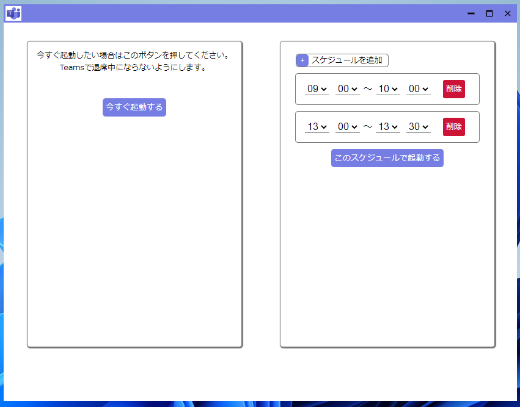

### 影武者　　
影武者はTeamsで退席中ステータスになるのを防ぐアプリです。  
お茶買いに行ったりするときに使います。  
tauri触ってrustの勉強しようと思って作成しましたが、ほとんどweb技術でできてしまいました。。。

・やってることは1分間ごとにwebviewからtauriコマンドを呼んであげる。  
・tauriコマンドでctrlキーを押下する。  

です。

#### TODO

- [ ] 「起動」「停止」ボタンは消す。（使ってみたら邪魔だった。）
- [ ] Teamsのアイコン探してきて見た目きれいにする。
- [ ] 何時～何時みたいに細かい設定できたほうが便利？
